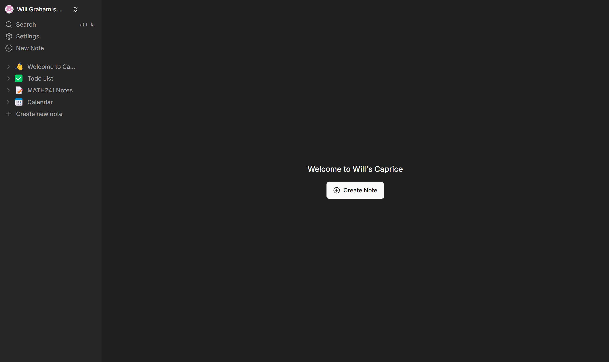
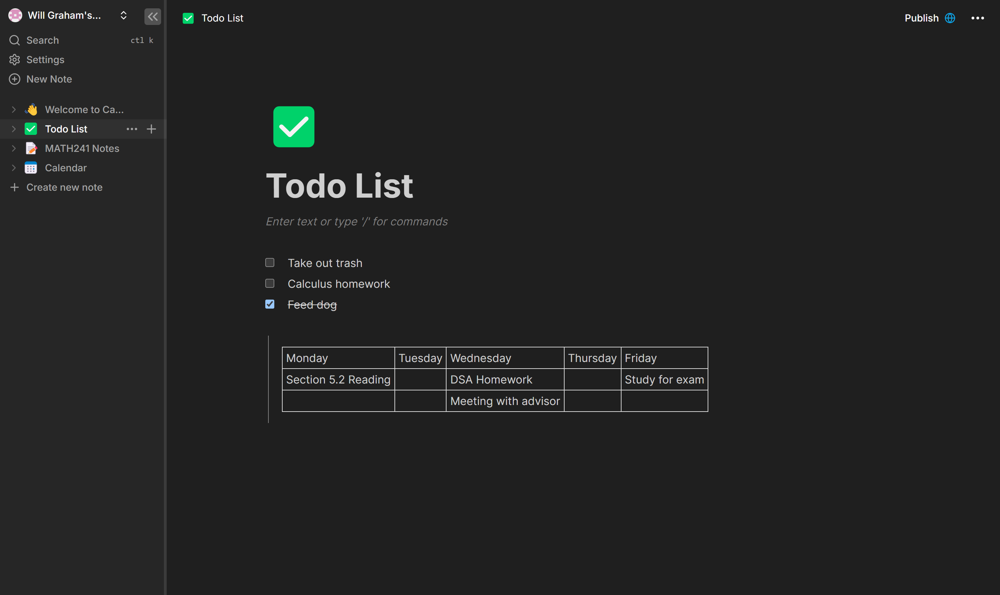
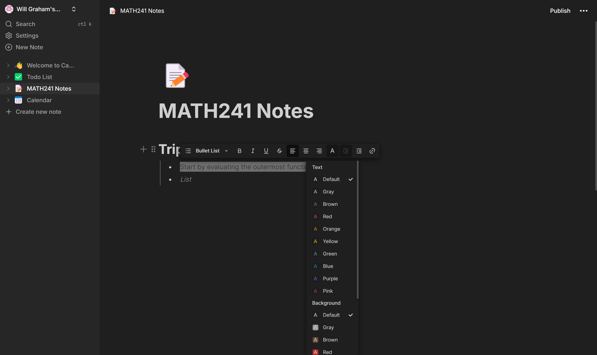
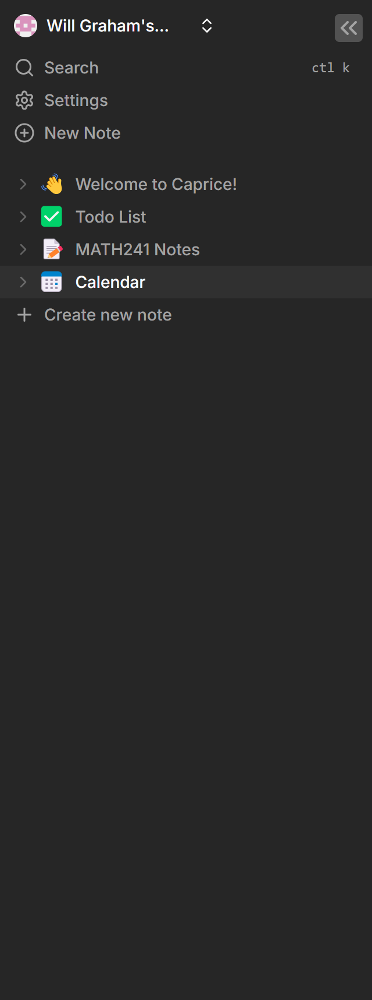
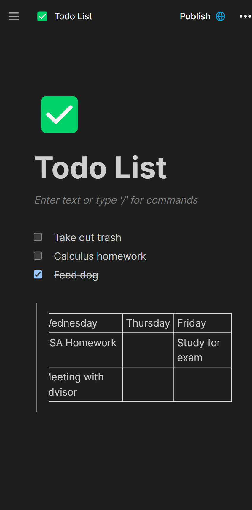

    
    <h3 align="center">Caprice</h3>

  

    A full-stack clone of Notion
     
    <a href="https://caprice-note-taking-app.vercel.app/preview/j57adsq9adw5br39mtnswsmy0x6xxrkv"><strong>Project Website</strong></a>
  

## About Caprice

Caprice is a full-stack clone of Notion, including all notable features such as a working user authentification system, block-note editing, similar nested-like structure to storing notes, dark/light mode, and much more. 

[![Caprice Main Screenshot][main-screenshot]](https://caprice-note-taking-app.vercel.app/preview/j57adsq9adw5br39mtnswsmy0x6xxrkv)

## Built With

Here are the technologies I used in creating this project:

* [![Next][Next.js]][Next-url]
* [![React][React.js]][React-url]
* [![TailWindCSS][TailWind]][TailWind-url]
* [![TypeScript][TypeScript]][TypeScript-url]
* [![Vercel][Vercel]][Vercel-url]
* ConvexDB
* Clerk

## Why I Built This Project

## What I learned 

## Image Gallery

    
    
    
    <h2>The website is fully responsive on mobile </h2>
    
    

<!-- CONTACT -->
## Contact

Will Graham - [LinkedIn](https://www.linkedin.com/in/will-graham-4623022a8/) - willgraham367@gmail.com

Project Link: [https://github.com/WillGraham36/caprice-notion-clone](https://github.com/WillGraham36/caprice-notion-clone)

[Next.js]: https://img.shields.io/badge/next.js-000000?style=for-the-badge&logo=nextdotjs&logoColor=white
[Next-url]: https://nextjs.org/
[React.js]: https://img.shields.io/badge/React-20232A?style=for-the-badge&logo=react&logoColor=61DAFB
[React-url]: https://reactjs.org/
[TailWind]: https://img.shields.io/badge/Tailwind_CSS-38B2AC?style=for-the-badge&logo=tailwind-css&logoColor=white
[TailWind-url]: https://tailwindcss.com/
[TypeScript]: https://img.shields.io/badge/TypeScript-007ACC?style=for-the-badge&logo=typescript&logoColor=white
[TypeScript-url]: https://www.typescriptlang.org/
[Vercel]: https://img.shields.io/badge/Vercel-000000?style=for-the-badge&logo=vercel&logoColor=white
[Vercel-url]: https://vercel.com/
[main-screenshot]: /public/caprice-main-screenshot.png
